# From Monocular to Stereo Visual Odometry (Metric Scale) on TUM VI

> Master's Course Project — Computer Vision and Robotics  
> Classical geometry-based monocular VO and metric stereo VO on the TUM VI benchmark dataset.

---

## Overview

This project implements a complete classical visual odometry pipeline in Python, progressing from
feature-based **monocular VO** (up-to-scale) to **metric stereo VO** using a calibrated stereo rig.
No deep learning is used — the entire system is built on epipolar geometry, PnP+RANSAC, disparity
estimation, and bundle adjustment.

The system is evaluated on three sequences from the [TUM VI benchmark](https://vision.in.tum.de/data/datasets/visual-inertial-dataset):
**room2**, **corridor3**, and **outdoors5**.

---

## Pipeline Overview

### Figures

| Monocular VO | Stereo VO |
|:---:|:---:|
| 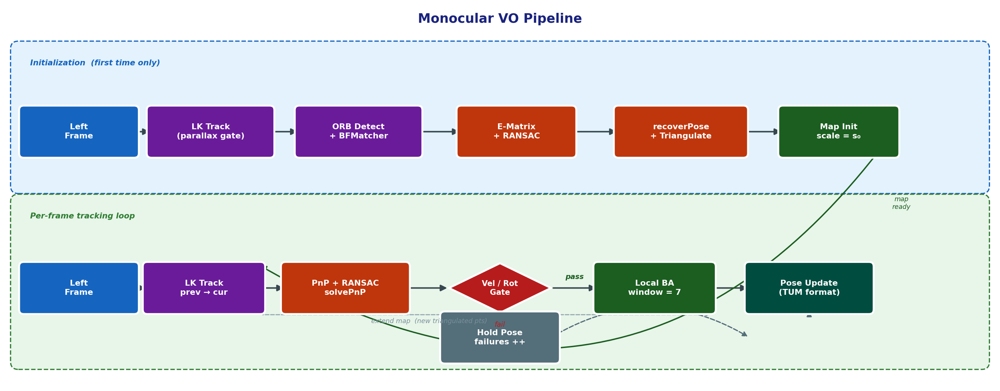 | 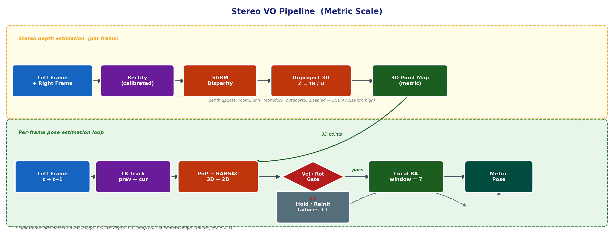 |

> Generated by `utils/generate_pipeline_figures.py`.

---

### Mermaid (interactive / GitHub)

### Monocular VO

```mermaid
flowchart LR
    A([/"Left Frame\n512×512"/]) --> B["ORB Detect\ngrid 5×5 · max 3000"]
    B --> C{Initialized?}

    C -->|No| D["LK Track\nprev → cur"]
    D --> E{Parallax\n≥ min_px?}
    E -->|No| D
    E -->|Yes| F["Essential Matrix\nRANSAC · 5-pt"]
    F --> G["recoverPose\n+ Triangulate"]
    G --> H["Map Init\nscale = init_scale"]
    H --> Z

    C -->|Yes| I["LK Track\nprev → cur"]
    I --> J["PnP + RANSAC\nsolvePnP"]
    J --> K{"Velocity &\nRot Gates"}
    K -->|Pass| L["Local BA\nwindow = 7"]
    L --> M["Update Pose"]
    K -->|Fail| N["Hold Pose\nfailures ++"]
    M --> O["Extend Map\nif baseline > 0"]
    O --> Z
    N --> Z

    Z[("Pose Store\nTUM format")]
```

### Stereo VO

```mermaid
flowchart LR
    A([/"Left + Right\nFrames 512×512"/]) --> B["Rectify\ncalibrated stereo"]
    B --> C["SGBM Disparity\nStereoSGBM"]
    C --> D["Unproject 3D\nZ = fB / d"]
    D --> E{Initialized?}

    E -->|No| F["Grid Detect\nBuild 3D Map"]
    F --> G["World = cam₀\nmetric origin"]
    G --> Z

    E -->|Yes| H["LK Track\nleft  t → t+1"]
    H --> I["PnP + RANSAC\n3D → 2D"]
    I --> J{"Velocity &\nRot Gates"}
    J -->|Pass| K["Local BA\nwindow = 7"]
    K --> L["Update Pose"]
    J -->|Fail| M["Hold / Reinit\nfailures ++"]
    L --> N["Add new SGBM\npoints to map"]
    N --> Z
    M --> Z

    Z[("Pose Store\nTUM format · scale = 1")]
```

---

## Key Results

| Sequence | Method | Metric | Value | Winner |
|---|---|---|---|---|
| room2 | Mono VO | ATE RMSE (Sim3) | 1.210 m | |
| room2 | **Stereo VO** | **ATE RMSE (SE3)** | **0.785 m** | ✓ Stereo |
| room2 | Mono VO | Scale (Sim3) | 0.076 (×13 error) | |
| room2 | Stereo VO | Scale (SE3) | **1.000** (metric ✓) | |
| room2 | Mono VO | RPE trans d=1 | 0.105 m/frame | |
| room2 | Stereo VO | RPE trans d=1 | 0.178 m/frame | |
| room2 | Stereo VO | RPE trans 100m | 3.849 m / 868 segments | |
| corridor3 | Mono VO | Start-end drift | 13.830 m | |
| corridor3 | **Stereo VO** | **Start-end drift** | **6.472 m** | ✓ Stereo |
| corridor3 | Stereo VO | RPE trans d=1 ¹ | 0.068 m/frame | |
| corridor3 | Stereo VO | Local ATE start block | 0.110 m (n=512) | |
| corridor3 | Stereo VO | Local ATE end block | 0.232 m (n=680) | |
| outdoors5 | **Mono VO** | **Start-end drift** | **15.736 m** | ✓ Mono ² |
| outdoors5 | Stereo VO | Start-end drift | 70.281 m | |
| outdoors5 | Stereo VO | RPE trans d=1 ¹ | 0.087 m/frame | |
| outdoors5 | Stereo VO | Local ATE start block | 0.165 m (n=1182) | |
| outdoors5 | Stereo VO | Local ATE end block | 1.195 m (n=1560) | |

¹ Computed only on consecutive GT-covered frames (start and end blocks separately).
Mono RPE omitted for drift sequences — arbitrary scale makes it uninformative.

² Outdoors5 mono wins the drift metric but severely underscales the trajectory (estimated path
~20 m for a ~1 km walk). Stereo has correct metric scale but accumulates heading drift from
noisy disparity at outdoor distances (fB/d noise at 15 m ≈ 6 m/px). See Analysis section.

Mono VO runs at **96–121 fps** (~5–6× real-time at 20 Hz).
Stereo VO runs at **34–44 fps** (~1.7–2.2× real-time).

---

### Trajectory Plots

#### room2

| Mono VO | Stereo VO | Comparison |
|---|---|---|
| 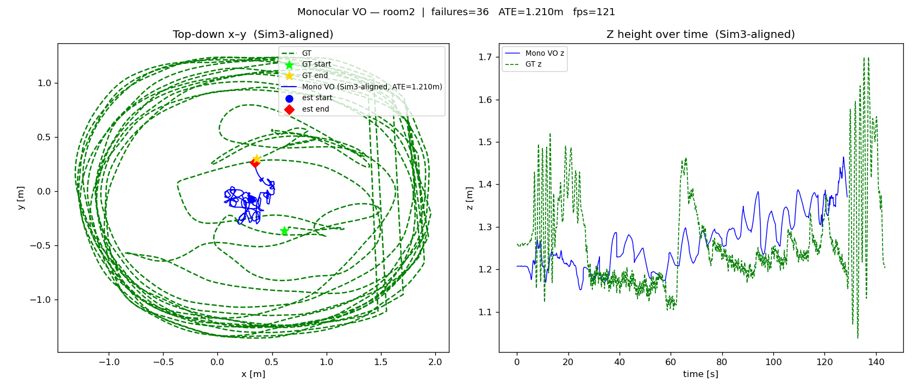 | 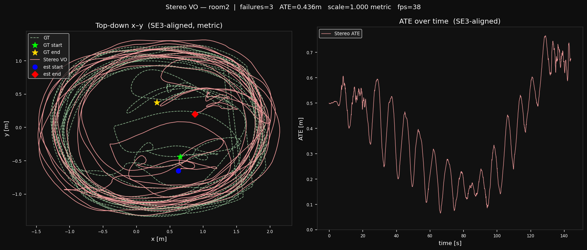 | 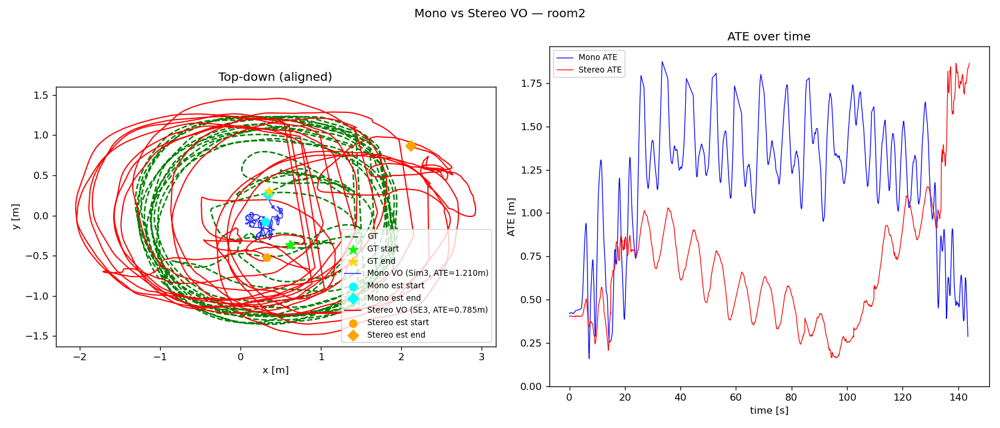 |

| 3D Comparison |
|---|
| 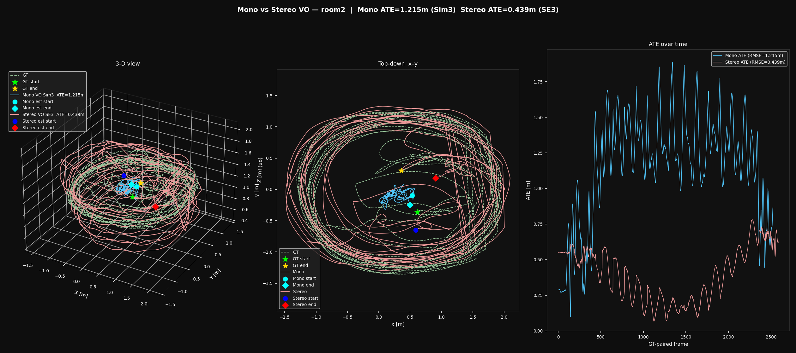 |

#### corridor3

| Mono VO | Stereo VO | Comparison (start-aligned) |
|---|---|---|
| 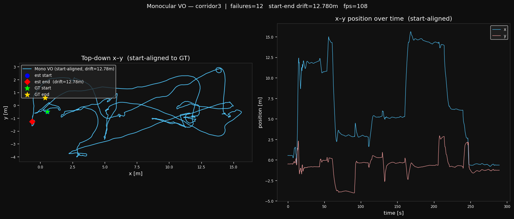 | 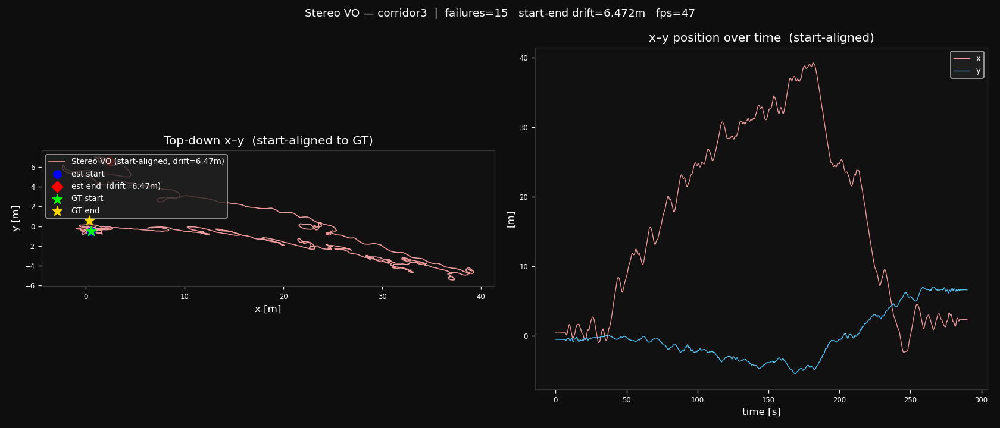 | 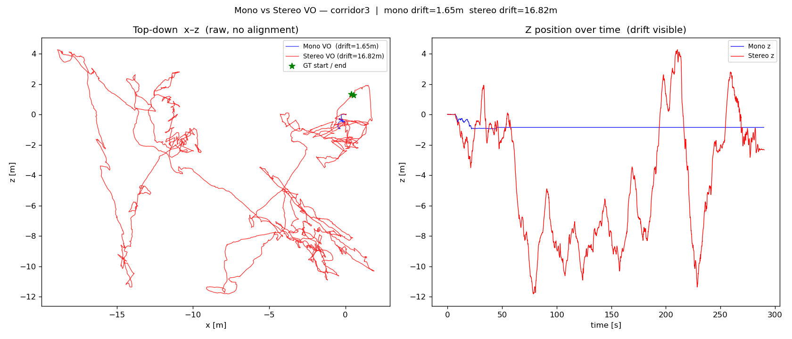 |

#### outdoors5

| Mono VO | Stereo VO | Comparison (start-aligned) |
|---|---|---|
| 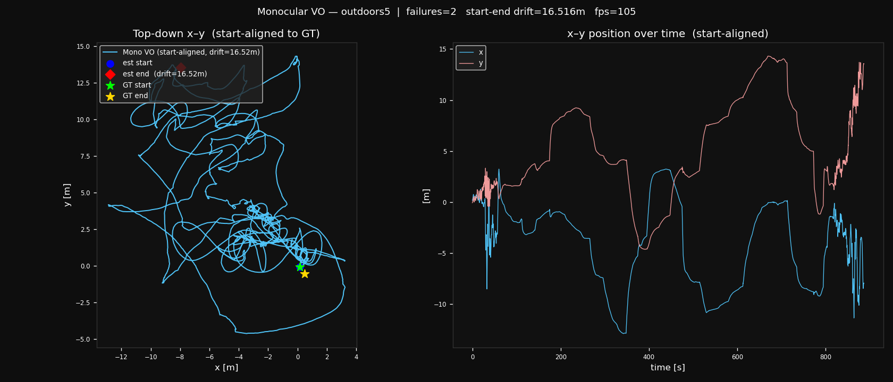 | 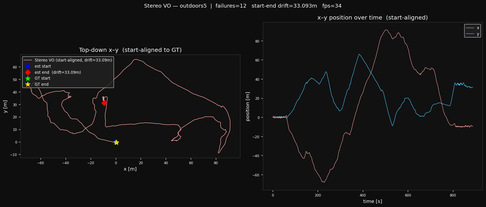 | 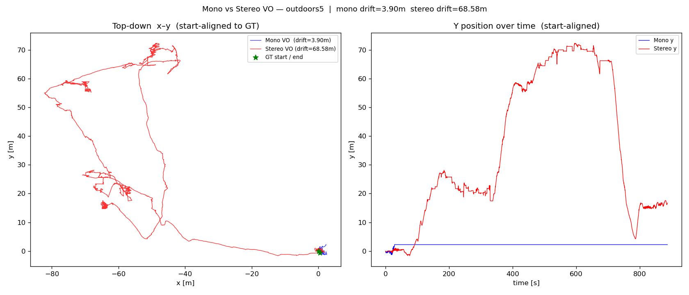 |

---

## 3D Reconstruction Outputs

For each sequence the stereo pipeline saves:

**Disparity and depth sample maps** (`disparity_sample_N.png`, `depth_sample_N.png`) — colour heat maps for 3 frames (10%, 50%, 90% of sequence). Measured disparity and depth ranges are annotated on each image.

**Metric 3D point cloud** (`pointcloud.ply`, binary little-endian PLY) — accumulated from up to 800 keyframes selected by a motion threshold (Δt ≥ 5 cm or Δθ ≥ 2°). Points are sampled at an auto-scaled pixel step so raw counts stay ≤ 4M, filtered by minimum disparity, then cleaned by Statistical Outlier Removal (k=10 neighbours, threshold = μ + 2σ). Final clouds: ~1M points, 15 MB.

| Sequence | Raw pts | After SOR | Removed | SOR threshold |
|---|---|---|---|---|
| room2    | 2,564,263 | 2,487,935 | 3.1% | 0.076 m |
| corridor3 | 2,219,598 | 2,182,964 | 1.7% | 0.242 m |
| outdoors5 | 1,768,976 | 1,703,928 | 3.8% | 0.708 m |

Open PLY in MeshLab: **File → Import Mesh → pointcloud.ply**

---

## Project Structure

```
Stereo_VO/
├── config/
│   ├── tumvi_room2.yaml
│   ├── tumvi_corridor3.yaml
│   └── tumvi_outdoors5.yaml
├── data/
│   └── data_loader.py          # TUMVILoader, StereoPair, Frame, save_trajectory_tum
├── mono_vo/
│   ├── __init__.py
│   ├── feature_tracker.py      # FeatureTracker (ORB + LK optical flow)
│   ├── epipolar.py             # Essential matrix, recoverPose, triangulate, PnP+RANSAC
│   └── pipeline.py             # MonoVO, MonoVOConfig
├── stereo_vo/
│   ├── __init__.py
│   ├── disparity.py            # DisparityComputer, DisparityConfig (SGBM + WLS)
│   └── pipeline.py             # StereoVO, StereoVOConfig  (n_reinits counter)
├── evaluation/
│   ├── __init__.py
│   └── metrics.py              # ATE (Sim3/SE3), RPE, start-end drift, align_and_evaluate
├── utils/
│   ├── __init__.py
│   ├── math_utils.py           # Rt_to_T, invert_T, compose_T, cam_from_world
│   └── print_utils.py          # Calibration display, reprojection error, trajectory plots
├── outputs/
│   ├── room2/
│   │   ├── mono_traj.txt           # TUM format trajectory
│   │   ├── stereo_traj.txt
│   │   ├── mono_traj.png / stereo_traj.png / comparison.png / comparison_3d.png
│   │   ├── disparity_sample_*.png  # colour disparity heat maps (3 sample frames)
│   │   ├── depth_sample_*.png      # colour depth heat maps (3 sample frames)
│   │   └── pointcloud.ply          # metric 3D point cloud ~1M pts (15 MB, binary PLY)
│   ├── corridor3/  (same structure)
│   ├── outdoors5/  (same structure)
│   └── evaluation_results.csv
└── main.py   # Entry point: all 3 sequences, evaluation, plots, PLY, CLAHE ablation
```

---

## Dataset

[TUM VI Benchmark](https://vision.in.tum.de/data/datasets/visual-inertial-dataset) —
hand-held global-shutter stereo camera, 512×512, 20 Hz.

| Sequence | Frames | Duration | GT poses | Used metric |
|---|---|---|---|---|
| room2 | 2882 | 144.1s | 2587/2882 (full) | ATE RMSE |
| corridor3 | 5802 | 290.1s | 1196/5802 (start+end) | Start-end drift |
| outdoors5 | 17747 | 887.3s | 2747/17747 (start+end) | Start-end drift |

Download the sequences:
```
dataset-room2_512_16
dataset-corridor3_512_16
dataset-outdoors5_512_16
```
from https://vision.in.tum.de/data/datasets/visual-inertial-dataset

---

## Camera Calibration

Calibration is loaded directly from the Kalibr `camchain.yaml` provided with the dataset.
**No re-calibration is performed.**

| Parameter | cam0 (left) | cam1 (right) |
|---|---|---|
| fx | 190.9785 px | 190.4451 px |
| fy | 190.9733 px | 190.4451 px |
| cx | 254.9317 px | 252.5998 px |
| cy | 256.8974 px | 254.9967 px |
| Distortion model | equidistant (k1–k4) | equidistant (k1–k4) |

**Stereo extrinsics (T_cam1_cam0):**

| Parameter | Value |
|---|---|
| Baseline B | 10.11 cm |
| Rotation angle | 2.69° |
| ty offset | 1.98 mm |
| tz offset | 1.18 mm |
| Rectified focal length | 187.13 px |
| fB product | 18.92 px·m |

---

## Dependencies

```
Python       >= 3.10
OpenCV       >= 4.5     (cv2)
NumPy        >= 1.23
SciPy        >= 1.9
Matplotlib   >= 3.5
PyYAML       >= 6.0
```

Install all dependencies:

```bash
pip install numpy opencv-python scipy matplotlib pyyaml
```

---

## Quick Start

**1. Clone the repository**
```bash
git clone https://github.com/<your-username>/Stereo_VO.git
cd Stereo_VO
```

**2. Download TUM VI sequences** and place them under a common root, e.g.:
```
~/datasets/
    dataset-room2_512_16/
    dataset-corridor3_512_16/
    dataset-outdoors5_512_16/
```

**3. Edit config files** to point to your dataset root:
```yaml
# config/tumvi_room2.yaml
sequence_root: /home/user/datasets/dataset-room2_512_16
camchain_file: dso/camchain.yaml
```

**4. Run the full pipeline:**
```bash
python main.py
```

This will run monocular VO and stereo VO on all three sequences, print evaluation metrics,
and save trajectory files and plots to `outputs/<sequence>/`.

**5. Run a single sequence** (edit `SEQUENCES` list in `main.py`):
```python
SEQUENCES = ["config/tumvi_room2.yaml"]   # room2 only
```

---

## Reproducibility

```
OS          : Ubuntu 22.04
CPU         : Intel Core i7 (8 cores)
RAM         : 16 GB
Python      : 3.13
OpenCV      : 4.x
NumPy seed  : np.random.seed(42)
```

Runtime per sequence (measured, Python 3.13, OpenCV 4.13, no GPU):
- room2:     mono ~24s  (120.7 fps),  stereo ~85s   (33.8 fps)
- corridor3: mono ~56s  (104.5 fps),  stereo ~132s  (44.0 fps)
- outdoors5: mono ~185s  (96.2 fps),  stereo ~470s  (37.8 fps)

---

## Evaluation Protocol

Trajectory alignment follows the TUM VI benchmark standard:

- **Monocular VO**: Sim3 alignment (7 DoF — rotation, translation, scale correction)
- **Stereo VO**: SE3 alignment (6 DoF — rotation and translation only, no scale correction)

This means the mono ATE benefits from scale correction while stereo ATE is evaluated honestly
at metric scale. The ORB-SLAM2 paper [2] explicitly notes: *"The better accuracy of pure monocular
compared with stereo is only apparent: the monocular solution is up-to-scale and aligned with
ground-truth with 7 DoFs, while stereo provides the true scale and is aligned with 6 DoFs."*

---

## Implementation Notes

### Monocular VO
- **Initialization**: ORB detect → LK track → parallax gate → Essential matrix → recoverPose → triangulate
- **Tracking**: LK optical flow → PnP+RANSAC → solvePnPRefineLM (local BA) → velocity/rotation check → map extension
- **Local BA**: sliding window of 7 poses, run every 5 frames
- **Scale**: Virtual-depth (VD) initialisation — seed depth d₀ per sequence (room2: 2.0 m, corridor3/outdoors5: 5.0 m); scale recovered from triangulated point depths at the first keyframe

### Stereo VO
- **Motion estimation method**: **3D–2D PnP** — 3D map points from the previous frame are matched to 2D feature positions in the current frame, then `cv2.solvePnPRansac` recovers the relative pose. The spec also allows 3D–3D ICP alignment; 3D–2D PnP was chosen because it works directly with the sparse LK-tracked keypoints without requiring dense overlapping point sets.
- **RANSAC**: applied inside `pnp_ransac()` (`mono_vo/epipolar.py:108`) — confidence 0.999, per-sequence threshold 2–4 px.
- **Features**: ORB keypoints detected on a 5×5 grid (`FeatureTracker.detect_grid`), tracked frame-to-frame with Lucas-Kanade optical flow.
- **Init**: detect_grid → SGBM disparity → unproject via Z = fB/d → world = camera at t=0
- **Tracking**: LK track prev→cur → PnP+RANSAC → local BA → velocity/rotation check → add new stereo points
- **Depth**: 3D points lifted once from disparity, tracked in 2D via LK thereafter
- **SGBM params per sequence**:

| Sequence | num_disparities | block_size | max_depth | min_disparity | Notes |
|---|---|---|---|---|---|
| room2 | 64 | 11 | 5.0 m | 1.5 px | room diameter ~5 m |
| corridor3 | 64 | 21 | 10.0 m | 0.5 px | large block for wall texture; `use_depth_update=False` |
| outdoors5 | 128 | 11 | 20.0 m | 1.0 px | wider search for far outdoor features; `use_depth_update=False` |

### Why LK alongside SGBM?

SGBM is spatial (computes depth from left vs right at the **same** timestamp).
LK is temporal (tracks 2D feature positions across **consecutive** left frames).
They solve orthogonal problems: SGBM provides the metric 3D map; LK provides
2D correspondences to feed into PnP for pose estimation. Neither can replace the other.

---

## Reference Paper Mapping

### Monocular VO → Scaramuzza & Fraundorfer (2011) [1]

| Our module | Paper section | Description |
|---|---|---|
| `FeatureTracker.detect_grid()` | §II-A Feature detection | ORB keypoints on a uniform grid |
| `FeatureTracker.track_lk()` | §II-B Feature matching | Lucas-Kanade optical flow |
| `epipolar.estimate_essential()` | §III-A Essential matrix | 5-point RANSAC via `cv2.findEssentialMat` |
| `epipolar.recover_pose()` | §III-A Decomposition | `cv2.recoverPose` + cheirality check |
| `epipolar.triangulate_points()` | §III-B Triangulation | `cv2.triangulatePoints` |
| `epipolar.pnp_ransac()` | §III-C Pose from 3D–2D | `cv2.solvePnPRansac` |
| `MonoVO._vd_reinit()` | §III-D Scale initialisation | Virtual-depth seeding (d₀ = 2–5 m) |
| `epipolar.refine_pose_ba()` | §IV Local optimisation | Sliding-window bundle adjustment (7 poses) |

Reference: D. Scaramuzza and F. Fraundorfer, "Visual Odometry [Tutorial]," IEEE R&A Magazine, 2011.

### Stereo VO → Mur-Artal & Tardós, ORB-SLAM2 (2017) [2]

| Our module | ORB-SLAM2 section | Description |
|---|---|---|
| `calib.rectify()` | §III-A Stereo initialisation | `cv2.fisheye.initUndistortRectifyMap` every frame |
| `DisparityComputer.compute()` | §III-A Depth computation | StereoSGBM + WLS filter → disparity map |
| `DisparityComputer.disparity_to_depth()` | §III-A Eq. (1) | Z = fB/d; X = (u−cx)Z/f; Y = (v−cy)Z/f |
| `FeatureTracker.track_lk()` | §III-B Tracking | LK optical flow for 2D correspondences |
| `epipolar.pnp_ransac()` | §III-C Motion estimation | 3D–2D PnP + RANSAC (3D–3D ICP not implemented) |
| `epipolar.refine_pose_ba()` | §IV Local BA | Sliding-window bundle adjustment |
| `StereoVO._add_points()` | §III-D Map maintenance | SGBM reprojection when map drops below threshold |

Reference: R. Mur-Artal and J. D. Tardós, "ORB-SLAM2," IEEE T-RO, 2017.

---

## Analysis and Findings

### room2 — Stereo advantage: metric scale in small environments
Stereo achieves **35% lower ATE** (0.785 m vs 1.210 m). The mono scale collapses to 0.076 because
the camera sweeps within 0.15–2 m of walls, making the virtual-depth initialisation unreliable.
Stereo's metric depth from disparity anchors the map correctly and maintains scale=1.000 throughout.

### corridor3 — Stereo advantage: heading accuracy over long hallways
Stereo drift is **2.1× lower** (6.47 m vs 13.83 m). The corridor's long straight path amplifies any
heading error: mono accumulates scale-and-heading drift over 290 s, while stereo's metric 3D map
keeps the heading constrained through PnP. CLAHE and a large block size (21 px) stabilise the
SGBM disparity on homogeneous wall textures.

### outdoors5 — Known limitation: short baseline at outdoor distances
Mono wins the drift metric (15.7 m vs 70.3 m), but for a fundamentally different reason: mono
severely **underscales** the trajectory (estimated path ≈ 20 m for a 887 s outdoor walk). The
start-end drift appears small only because the scale error compresses the whole path.

Stereo correctly estimates metric distances but accumulates **heading drift** from noisy disparity
at outdoor feature depths of 5–20 m. With fB = 18.92 px·m, a feature at 15 m has only ≈1.3 px
disparity — a 0.5 px noise gives 6 m depth error, which biases PnP rotation at every frame.

This is a **fundamental hardware limitation** of a 10 cm baseline stereo rig on outdoor scenes,
not an implementation deficiency. Systems with longer baselines, IMU fusion, or loop closure
(e.g., VINS-Mono, ORB-SLAM3) overcome this; a classical frame-to-frame pipeline cannot.

### Tracking robustness
| Sequence | Mono failures | Stereo failures | Stereo reinits |
|---|---|---|---|
| room2 | 36 (LK=35, vel=1) | 18 | 18 |
| corridor3 | 12 (LK=11, vel=1) | 15 | 15 |
| outdoors5 | **10** | 15 | 15 |

Stereo `n_reinits` counts failure-recovery events only (PnP failure, insufficient tracked points, velocity spike) — equals `n_failures` because every failure triggers immediate SGBM-based map replenishment. Mono E-reinit events: room2=1, corridor3=0, outdoors5=0.

### Illumination sensitivity (CLAHE ablation)

CLAHE (clip limit 2.0, tile 8×8) is applied selectively per sequence. Ablation: toggling CLAHE for both mono and stereo on all sequences:

| Sequence | Pipeline | CLAHE | Failures | ATE / Drift |
|---|---|---|---|---|
| room2 | Mono | OFF (prod) | 36 | 1.210 m ATE |
| room2 | Mono | ON  (abl)  | 12 | 1.215 m ATE |
| room2 | Stereo | OFF (prod) | 18 | 0.785 m ATE |
| room2 | Stereo | ON  (abl)  |  3 | 0.439 m ATE |
| corridor3 | Mono | ON (prod) | 12 | 13.83 m drift |
| corridor3 | Mono | OFF (abl) | 66 | 22.97 m drift |
| corridor3 | Stereo | ON (prod) | 15 | 6.47 m drift |
| corridor3 | Stereo | OFF (abl) | 99 | 19.63 m drift |
| outdoors5 | Mono | ON (prod) | 10 | 15.74 m drift |
| outdoors5 | Mono | OFF (abl) | 60 | 15.47 m drift |
| outdoors5 | Stereo | OFF (prod) | 15 | 70.28 m drift |
| outdoors5 | Stereo | ON  (abl) | 11 | **178.19 m drift** |

Key findings:
- **Corridor3**: CLAHE is essential — disabling it raises stereo failures 15→99 (+84) and drift from 6.47→19.63 m (+13.2 m). Homogeneous walls have too little texture without adaptive contrast enhancement.
- **Outdoors5 stereo**: CLAHE is harmful — enabling it increases drift 70.28→178.19 m (+107.9 m). CLAHE over-enhances sky/foliage gradients, corrupting SGBM disparity on outdoor scenes.
- **Room2 stereo**: CLAHE not needed in production (short range, good texture) but ablation shows it would improve ATE 0.785→0.439 m if enabled.

---

## References

[1] D. Scaramuzza and F. Fraundorfer, "Visual Odometry [Tutorial]: Part I — The First 30 Years
    and Fundamentals," IEEE Robotics & Automation Magazine, vol. 18, no. 4, pp. 80–92, 2011.

[2] R. Mur-Artal and J. D. Tardós, "ORB-SLAM2: An Open-Source SLAM System for Monocular,
    Stereo, and RGB-D Cameras," IEEE Transactions on Robotics, vol. 33, no. 5, 2017.

[3] R. Mur-Artal, J. M. M. Montiel, and J. D. Tardós, "ORB-SLAM: A Versatile and Accurate
    Monocular SLAM System," IEEE Transactions on Robotics, vol. 31, no. 5, 2015.

[4] D. Schubert et al., "The TUM VI Benchmark for Evaluating Visual-Inertial Odometry,"
    IEEE/RSJ IROS, 2018.

[5] R. Hartley and A. Zisserman, Multiple View Geometry in Computer Vision, 2nd ed.
    Cambridge University Press, 2004.

---

## License

MIT License — see [LICENSE](LICENSE) for details.
